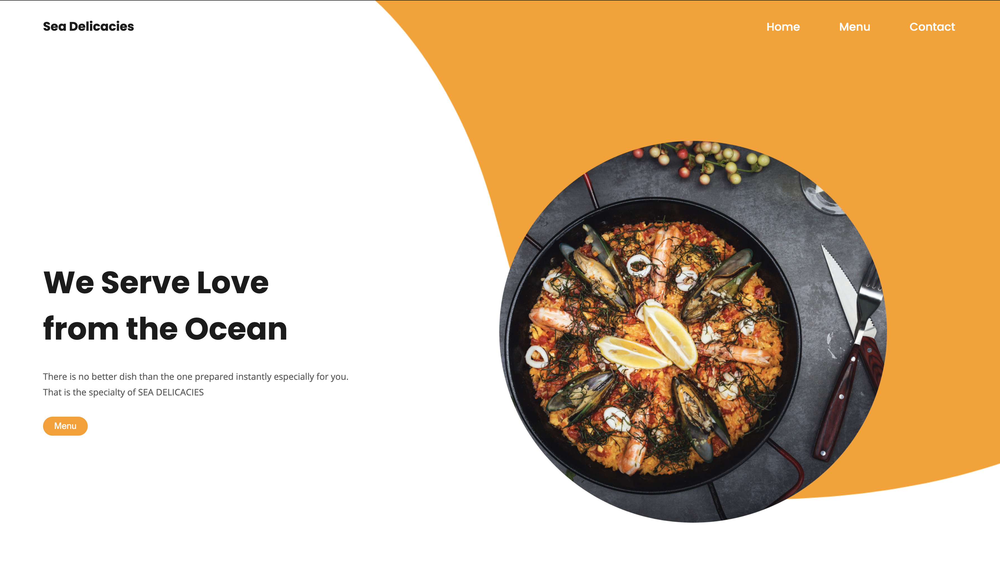
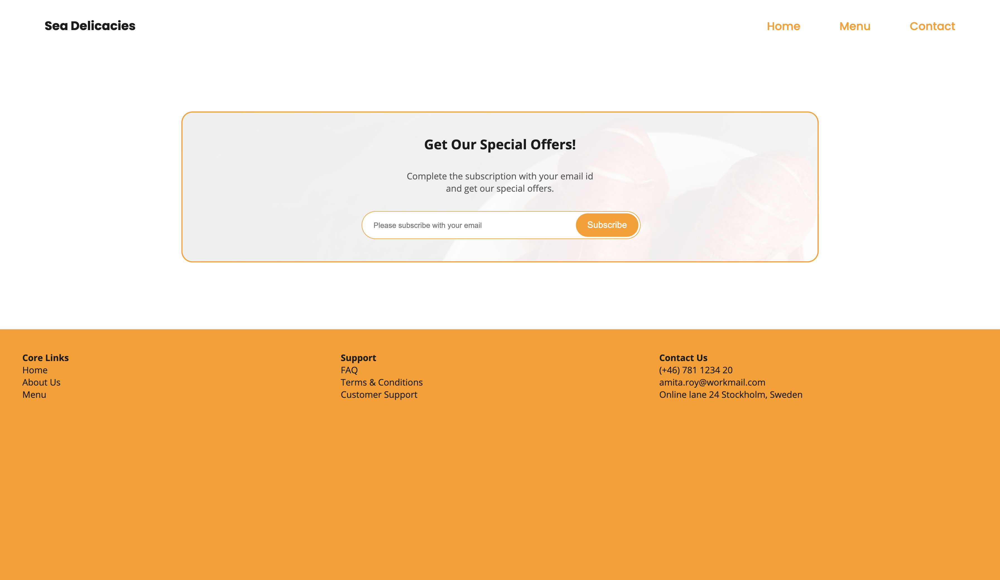

# Sea Delicacies (Restaurant Page) (Page is not responsive)

> DOM manipulation by dynamically rendering a simple restaurant homepage!. I have used JavaScript alone to generate the entire contents of the website!. I have created 3 pages (Home, Menu and Contact) for this project. User can switch to different tab by clicking on each nav item on the page.

> Home page
> 

> Menu Page
> 

> Contact Page
> 

## Built With

- Javascript
- Jquery
- ESLint
- Stylelint

## Live Demo

[sea-delicacies](https://sea-delicacies-git-homepage.royamita.vercel.app/)

### Prerequisites

Ruby: 2.7.2
Rails: 5.2.3
Postgres: >=9.5

**Setup**

- Clone this repository with: "git clone git@github.com:Amita-Roy/Sea-Delicacies.git" using your terminal or command line.

- Change to the project directory by entering cd "sea-delicacies" in the terminal

- Next run npm install to install the necessary dependencies

- Finally run the 'npm run build' and 'npm run start' to start the application

### Usage

Start server with:

```
    npm start
```

## Author

👤 **Amita Roy**

- Github: [@Amita](https://github.com/Amita-Roy)
- Twitter: [@Amita](https://twitter.com/AmitaRoy14)
- Linkedin: [@Amita](https://www.linkedin.com/in/amita-roy-3b823b68/)

## 🤝 Contributing

Contributions, issues and feature requests are welcome!

Feel free to check the [issues page](issues/).

## Show your support

Give a ⭐️ if you like this project!

## Acknowledgments

- Stock images from unsplash

  - [Unsplash](https://unsplash.com/s/photos/seafood?utm_source=unsplash&utm_medium=referral&utm_content=creditCopyText)
  - [Pexels](https://www.pexels.com/photo/salad-with-salmon-covered-with-black-and-white-sesame-seeds-4193843/?utm_content=attributionCopyText&utm_medium=referral&utm_source=pexels)

- Photo by Ting Tian on Unsplash
- Photo by Anastasiia Rusaeva on Unsplash
- Photo by CHUTTERSNAP on Unsplash
- Photo by Malidate Van from Pexels
- Photo by Dana Tentis from Pexels
- Photo by Diego Pontes from Pexels
- Photo by Ponyo Sakana from Pexels
- Photo by ROMAN ODINTSOV from Pexels
- Photo by David Todd McCarty on Unsplash
- Photo by Olayinka Babalola on Unsplash
- Photo by Cooker King on Unsplash

## 📝 License
